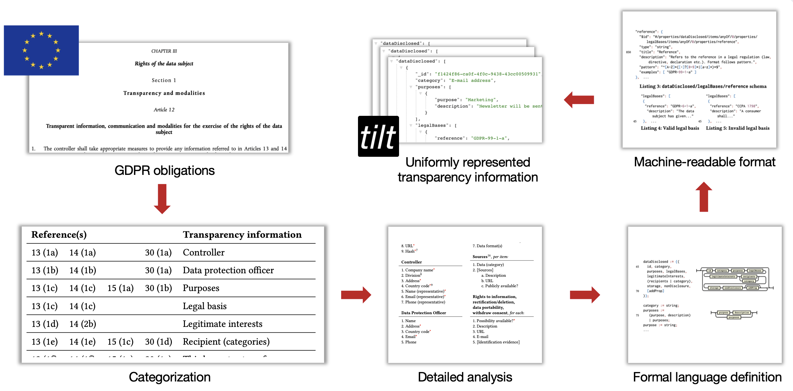
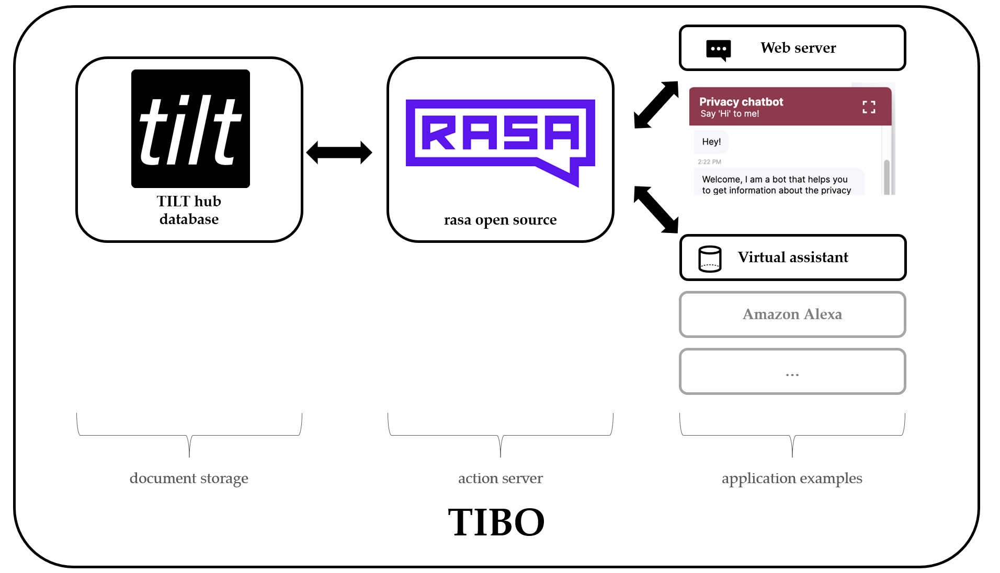

# TILT

We present TILT, a transparency information language and toolkit explicitly designed to represent and process transparency information in line with the requirements of the **GDPR** and allowing for a more automated and adaptive use of such information than established, legalese data protection policies do.

We provide a detailed analysis of transparency obligations from the GDPR to identify the expressiveness required for a **formal transparency language** intended to meet respective legal requirements. In addition, we identify a set of further, non-functional requirements that need to be met to foster practical adoption in real-world (web) information systems engineering. On this basis, we specify our formal language and present a respective, **fully implemented toolkit** around it. We then evaluate the practical applicability of our language and toolkit and demonstrate the additional prospects it unlocks through two different use cases: a) the **inter-organizational analysis of personal data-related practices** allowing, for instance, to uncover data sharing networks based on explicitly announced transparency information and b) the **presentation of formally represented transparency information to users through novel, more comprehensible, and potentially adaptive user interfaces**, heightening data subjects’ actual informedness about data-related practices and, thus, their sovereignty.

Altogether, our transparency information language and toolkit allow – differently from previous work – to express transparency information **in line with actual legal requirements and practices of modern (web) information systems engineering** and thereby pave the way for a multitude of novel possibilities to heighten transparency and user sovereignty in practice.



# Try it out
## Installation
Install the python client library using pip. See the [project page](https://pypi.org/project/tilt/).

```console
foo@bar:~$ pip3 install tilt
Collecting tilt
  Using cached tilt-0.0.1-py3-none-any.whl (22 kB)
Installing collected packages: tilt
Successfully installed tilt-0.0.1
```

## Basic usage
1) Import the transparency information language binding/library.
2) Create your first object, e.g. a Data Protection Officer with their contact details.
3) Continue creating your objects, i.e. a Controller and its Representative.
4) ... (add all other fields, not shown in here) ...


```python
from tilt import tilt

dpo = tilt.DataProtectionOfficer(name='Max Ninjaturtle', address='21 Jump Street', country='DE', email='jane@mycompany.com', phone='0142 43333')
print(dpo.to_dict())
# {'address': '21 Jump Street', 'country': 'DE', 'email': 'jane@mycompany.com', 'name': 'Max Ninjaturtle', 'phone': '0142 43333'}


r = tilt.ControllerRepresentative(name='Maxi Müller', email='maxi@mail.com', phone=None)
c = tilt.Controller(name='MyCompany', address='Straße des 17. Juni', country='DE', division='Main', representative=r)
print(c.to_dict())
# {'address': 'Straße des 17. Juni', 'country': 'DE', 'division': 'Main', 'name': 'MyCompany', 'representative': {'email': 'maxi@mail.com', 'name': 'Maxi Müller', 'phone': None}}
```

See here for an interactive playground [](https://mybinder.org/v2/gh/Transparency-Information-Language/python-tilt/master?filepath=python-tilt-example.ipynb), in which you can run python-tilt in a Juypter notebook.


## Developer-focused Transparency Enhancing Technologies
Following projects demonstrate practical privacy engineering solutions developed at TU Berlin.

### Hawk
The Hawk Framework provides a way of tracking the dataflow between applications and allows for GDPR related tags to be added to the data references. It also features an analytical dashboard about the GDPR related information and integration for using the ratio of GDPR-tagged data in e.g. Flagger Canary releases. 

For further information see: [Hawk Repository](https://github.com/PrivacyEngineering/hawk) & [Hawk Paper](https://arxiv.org/pdf/2306.02496.pdf).


### TIRA
We introduce a transparency-focused extension of OpenAPI specifications that allows individual service descriptions to be enriched with transparency-related annotations in a bottom-up fashion and a set of higher-order tools for aggregating respective information across multiple, interdependent services and for coherently integrating our approach into automated CI/CD-pipelines. Together, these building blocks pave the way for providing transparency information that is more specific and at the same time better reflects the actual implementation givens within complex service architectures than current, overly broad privacy statements. 

For further information see: [TIRA Repository](https://github.com/PrivacyEngineering/tira) & [TIRA Paper](https://ieeexplore.ieee.org/document/9583685).

### Teiresias
Teiresias is a distributed system, consisting of an Apache Airflow Celery Cluster and an additional Client-Server architecture for semi-automatic discovery and inventory of personal data in distributed systems environments.

For further information see: [Teiresias Repository](https://github.com/teiresias-personal-data-discovery/teiresias-system) & [Teiresias Paper](https://arxiv.org/pdf/2209.10412.pdf).


### TILT enhanced BPMN
coming soon.

## Privacy Interfaces
Following projects demonstrate practical use cases for TILT-enabled transparency.

### Transparency Information Bot (TIBO)
Development of a conversational AI with which users can communicate (as a user interface to tilt documents).

Possible applications:
1. Transparency:
Users can request/get (parts of) transparency information (from tilt documents).
Our user study shows, that TIBO purifies textual privacy policies and achieves the goal of making transparency information more accessible for users.

2. Data subject access requests:
  a) users can specify what info they want to request from a service (in tilt it says what data is collected -> are "offered" by chatbot) -> (email) request is generated automatically
  b) ask users if and which information should be deleted -> (email) deletion request is generated automatically
  -> bridge to supported information requests

The following figure shows the general architecture of TIBO.


For further information see: [TIBO Repository](https://github.com/Transparency-Information-Language/chatbot) & try it here: [TIBO on the web](https://daskita-chatbot.infra.ise-apps.de/).

### CODE2
A TILT extension for Chrome and Firefox browsers which allow users to see wether there is a TILT representation of the transparency information, before even visiting the webpage - directly on your Google Search page.

For further information see: [CODE2 Repository](https://pub.h-brs.de/frontdoor/index/index/docId/6021) & [CODE2 Paper](https://pub.h-brs.de/frontdoor/deliver/index/docId/6021/file/02_Gruenewald.pdf).


# Contact Info
If you have questions, open an issue here on Github or contact Elias Grünewald via his [institutional website](https://tu.berlin/ise/eg) or [LinkedIn](https://www.linkedin.com/in/eliasgruenewald/).

[](https://www.tu.berlin) [](https://www.tu.berlin/ise/projekte/toucan) 